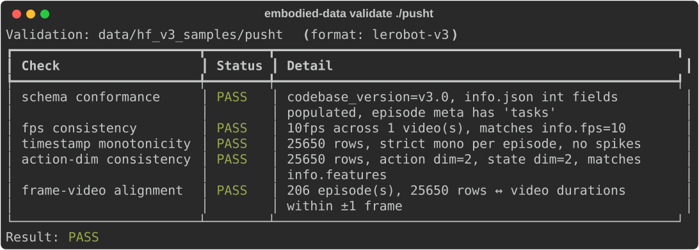

# embodied-data

Bidirectional converter and validator for AgiBot World ↔ LeRobot v3 datasets.

[](https://pypi.org/project/embodied-data/)
[](https://pypi.org/project/embodied-data/)
[](https://github.com/allenwu-blip/embodied-data/actions/workflows/ci.yml)
[](LICENSE)

## What it does

- **Bidirectional conversion** between AgiBot World (DigitalWorld sim + Beta/Alpha real hardware) and LeRobot v3.
- **Schema-detect dispatcher** — point `convert` at any AgiBot root and the right reader fires automatically.
- **Five-check validator** — schema conformance, fps consistency, timestamp monotonicity, action-dim consistency, frame ↔ video alignment.
- **Batch + resume** — `--max-episodes` for parallel conversion, `meta/uuid_map.parquet` for restartable jobs.
- **Stdlib-first** — h5py + pyarrow + av; no PyTorch dependency in the data path.

## Quick start

LeRobot's pusht is the fastest end-to-end check (no HuggingFace gating, ~30 s):

```bash
pip install --upgrade embodied-data
huggingface-cli download lerobot/pusht --repo-type dataset --local-dir ./pusht

embodied-data preview  ./pusht
embodied-data validate ./pusht
```

`preview` prints a per-episode stats table; `validate` runs all five checks and exits non-zero on failure.

## Real AgiBot data (HuggingFace gated)

AgiBot World Beta and Alpha live on HuggingFace under a gated license. Request access on the [AgiBotWorld-Beta](https://huggingface.co/datasets/agibot-world/AgiBotWorld-Beta) page first, then:

```bash
huggingface-cli login
huggingface-cli download agibot-world/AgiBotWorld-Beta \
    --repo-type dataset \
    --include "task_info_675.json" "observations/675/936938/**" "proprio_stats/675/936938.h5" \
    --local-dir ./agibot_beta_root

embodied-data convert \
    ./agibot_beta_root/675/936938 \
    /tmp/beta_v3 \
    --from agibot --to lerobot-v3

embodied-data validate /tmp/beta_v3
```

For batch conversion of a whole task, point `convert` at the task root and pass `--max-episodes N`. Streaming-extraction tips for partial Beta downloads are in [`docs/schema/beta.md`](docs/schema/beta.md).

## Validation example



## Why this exists

Robotics researchers spend days rewriting the same dataset conversion scripts. AgiBot World's official `convert_to_lerobot.py` has carried [unresolved issues](https://github.com/OpenDriveLab/AgiBot-World/issues) for months; LeRobot's v2.0 / v2.1 / v3.0 versions [break each other](https://github.com/huggingface/lerobot/issues/2158); every lab writes its own timestamp alignment check. This tool is the layer that stops.

Concrete upstream issues this project addresses or works around:

- [AgiBot-World #18](https://github.com/OpenDriveLab/AgiBot-World/issues/18) — `task_info_*.json` lookup ambiguity for sub-roots
- [AgiBot-World #124](https://github.com/OpenDriveLab/AgiBot-World/issues/124) — Beta vs Alpha schema divergence
- [AgiBot-World #149](https://github.com/OpenDriveLab/AgiBot-World/issues/149) — proprio HDF5 key drift across batches
- [lerobot #2158](https://github.com/huggingface/lerobot/issues/2158) — v2 ↔ v3 episode-index incompatibility
- [lerobot #2689](https://github.com/huggingface/lerobot/issues/2689) — fps/timestamp validation gap

## Roadmap

- **v0.2.x patches** — single-episode task-name resolution, doc polish (see [`docs/v0.2.x-patches.md`](docs/v0.2.x-patches.md)).
- **v0.3** — video stream metadata, sparse episode index, end-effector pose channels.
- **v0.4+** — ALOHA HDF5 ingest, RLDS export, OpenX Embodiment alignment.

Cross-embodiment action-space retargeting and Chinese prompt embedding remain explicit non-goals.

## Schema reference

- [`docs/schema/overview.md`](docs/schema/overview.md) — AgiBot variant matrix
- [`docs/schema/digitalworld.md`](docs/schema/digitalworld.md) — DigitalWorld (sim) layout
- [`docs/schema/beta.md`](docs/schema/beta.md) — Beta / Alpha (real hardware) layout
- [`docs/schema-lerobot-v3.md`](docs/schema-lerobot-v3.md) — LeRobot v3 target schema

## Install

```bash
pip install embodied-data
embodied-data --help
```

Python 3.12+ required.

### Development

```bash
git clone https://github.com/allenwu-blip/embodied-data.git
cd embodied-data
uv sync
uv run pytest
```

## Coverage

- 48 commits, 3 PyPI releases (0.1.0 / 0.1.1 / 0.2.0)
- 98 passing tests + 1 skipped (gated dataset)
- 4 upstream issue threads engaged
- 4 HuggingFace datasets exercised end-to-end (lerobot/pusht, AgiBotWorld-Beta, AgiBotWorld-Alpha, agibot-world/agibot_digital_world)

## Acknowledgments

- HuggingFace LeRobot team for the v3 schema and reference datasets
- OpenDriveLab AgiBot World team for releasing Beta and Alpha under HF gating

## License

MIT — see [`LICENSE`](LICENSE).

## Contact

Bug reports and feature requests: [GitHub Issues](https://github.com/allenwu-blip/embodied-data/issues).
